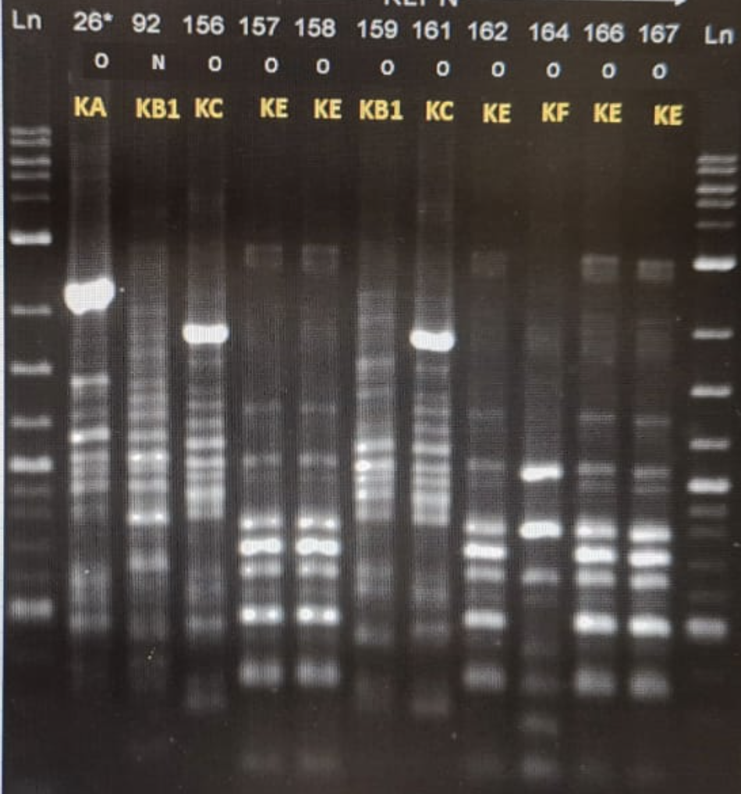

# Gene Sequence Analysis

This repository contains tools for analyzing and comparing gene sequences from gel electrophoresis images.

## Example Input/Output

### Input Image

*Figure 1: Input gel electrophoresis image with 11 samples*

### Output Analysis

*Figure 2: Analysis results showing lane detection and similarity matrix*

### Input File Specification:
- **Format**: JPEG (JFIF standard)
- **Resolution**: 1600 x 739 pixels
- **Color**: RGB
- **Samples**: 11 lanes

### Lane Visualization:

```
1   2   3   4   5   6   7   8   9   10  11  ← Sample Numbers
│   │   │   │   │   │   │   │   │   │   │
│   │   │   │   │   │   │   │   │   │   │
│   │   │   │   │   │   │   │   │   │   │
│   │   │   │   │   │   │   │   │   │   │
└───┴───┴───┴───┴───┴───┴───┴───┴───┴───┘
```

### Expected Input Format:
- Clear, well-lit image of the gel
- Lanes should be roughly vertical
- Bands should be clearly visible
- Include a ladder/marker lane if available for size reference

## Analysis Results

### Visual Output


### Detailed Analysis

1. **Sample Similarity**:
   - Samples 4-10 show high similarity (low distance values)
   - Sample 11 is significantly different from all others
   - Samples 1-3 show moderate similarity to each other

2. **Key Observations**:
   - **Sample 11** is an outlier (average distance > 1.0 from all others)
   - **Samples 7-10** form the most similar group (distance < 0.1 between them)
   - **Samples 1-3** form a separate cluster with distinct band patterns

3. **Similarity Matrix** (lower values = more similar):
   ```
   [[0.   0.26 0.24 0.11 0.11 0.17 0.24 0.24 0.27 0.29 0.97]
    [0.26 0.   0.07 0.09 0.12 0.1  0.11 0.11 0.11 0.12 1.01]
    [0.24 0.07 0.   0.08 0.14 0.12 0.15 0.15 0.16 0.2  1.  ]
    [0.11 0.09 0.08 0.   0.02 0.04 0.09 0.1  0.11 0.16 1.02]
    [0.11 0.12 0.14 0.02 0.   0.02 0.07 0.09 0.12 0.17 0.99]
    [0.17 0.1  0.12 0.04 0.02 0.   0.03 0.05 0.07 0.12 1.05]
    [0.24 0.11 0.15 0.09 0.07 0.03 0.   0.01 0.04 0.09 1.07]
    [0.24 0.11 0.15 0.1  0.09 0.05 0.01 0.   0.02 0.08 1.08]
    [0.27 0.11 0.16 0.11 0.12 0.07 0.04 0.02 0.   0.07 1.14]
    [0.29 0.12 0.2  0.16 0.17 0.12 0.09 0.08 0.07 0.   1.1 ]
    [0.97 1.01 1.   1.02 0.99 1.05 1.07 1.08 1.14 1.1  0.  ]]
   ```

4. **Interpretation**:
   - Distances < 0.1 indicate very similar banding patterns
   - Distances > 0.2 indicate distinct patterns
   - Sample 11 shows significant differences from all other samples

## Features

- **Gel Image Analysis**: Process gel electrophoresis images to detect and compare DNA bands
- **Sequence Comparison**: Compare DNA sequences and calculate similarity scores
- **Visualization**: Generate visual representations of sequence comparisons

## Installation

1. Clone the repository:
   ```bash
   git clone <repository-url>
   cd gene_sequence
   ```

2. Install the required packages:
   ```bash
   pip install -r requirements.txt
   ```

## Usage

### Gel Image Analysis

To analyze a gel electrophoresis image:
```bash
python gel_analyzer.py path_to_your_image.jpg
```

### Sequence Comparison

To compare DNA sequences:
```bash
python sequence_comparison.py
```

## Project Structure

- `gel_analyzer.py`: Analyzes gel electrophoresis images and generates similarity reports
- `sequence_comparison.py`: Compares DNA sequences and calculates alignment scores
- `requirements.txt`: Lists required Python packages
- `.gitignore`: Specifies files to ignore in version control
- `gel_analysis.png`: Example output image (generated after analysis)
- `sequence_comparison.png`: Example sequence alignment visualization

## License

This project is licensed under the MIT License - see the [LICENSE](LICENSE) file for details.
