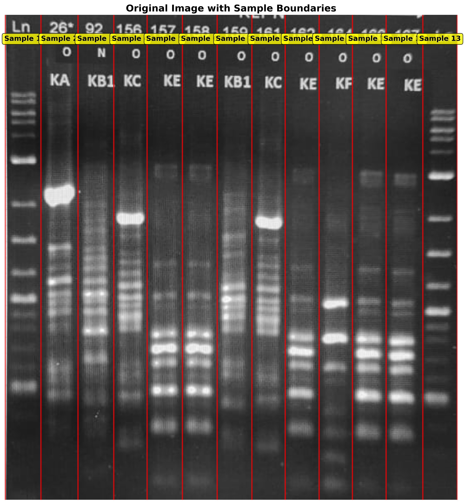
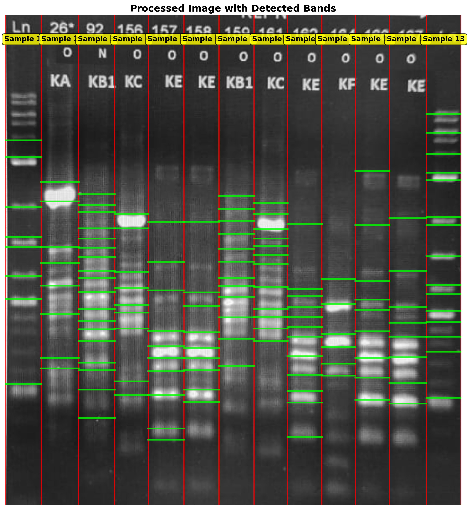
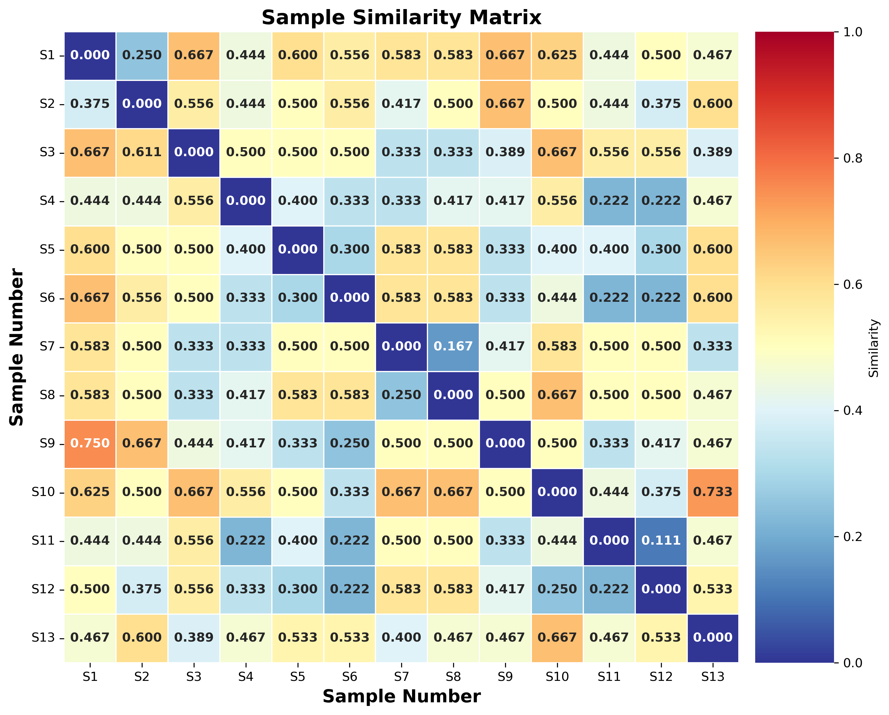

# Gene Sequence Analysis

This repository contains tools for analyzing and comparing gene sequences from gel electrophoresis images using advanced computer vision and machine learning techniques.

## Overview

The gel analyzer processes electrophoresis images to:
- Detect sample lane boundaries automatically
- Identify DNA bands within each lane
- Calculate similarity scores between samples
- Generate comprehensive visualizations and reports

## Example Analysis Results

### Input Image

*Figure 1: Input gel electrophoresis image with 13 samples*

### Analysis Outputs

#### 1. Original Image with Sample Boundaries

*Figure 2: Original image showing detected sample lane boundaries (red lines) and sample numbers*

#### 2. Processed Image with Detected Bands

*Figure 3: Processed image showing detected DNA bands (green lines) across each sample lane*

#### 3. Similarity Matrix Heatmap

*Figure 4: Heatmap showing pairwise similarity scores between all samples (higher values = more similar)*

#### 4. Complete Analysis Visualization

*Figure 5: Comprehensive analysis showing original image, processed bands, similarity matrix, and detailed statistics*

## Analysis Results Summary

### Band Detection Statistics
- **Total bands detected**: 136 bands
- **Average bands per sample**: 10.5
- **Analysis region**: Y ≥ 170 pixels
- **Sample numbers detected**: 4 (via OCR)

### Individual Sample Results
| Sample | Bands Detected | Notes |
|--------|----------------|-------|
| Sample 1 | 8 bands | - |
| Sample 2 | 8 bands | - |
| Sample 3 | 18 bands | **Highest count** |
| Sample 4 | 9 bands | - |
| Sample 5 | 10 bands | - |
| Sample 6 | 9 bands | - |
| Sample 7 | 12 bands | - |
| Sample 8 | 12 bands | - |
| Sample 9 | 12 bands | - |
| Sample 10 | 6 bands | **Lowest count** |
| Sample 11 | 9 bands | - |
| Sample 12 | 8 bands | - |
| Sample 13 | 15 bands | - |

### Similarity Analysis

#### Most Similar Sample Pairs (similarity > 0.7):
1. **Samples 11-12**: 0.889 similarity (0.111 distance) - **Most similar**
2. **Samples 7-8**: 0.833 similarity (0.167 distance)
3. **Samples 1-2**: 0.750 similarity (0.250 distance)
4. **Samples 5-6**: 0.700 similarity (0.300 distance)
5. **Samples 5-12**: 0.700 similarity (0.300 distance)

#### Additional Similar Pairs (similarity > 0.7):
- **Samples 4-11**: 0.778 similarity
- **Samples 6-11**: 0.778 similarity
- **Samples 4-12**: 0.778 similarity
- **Samples 6-12**: 0.778 similarity

### Key Observations

1. **Sample Clustering**:
   - **Group 1**: Samples 7-8 (very high similarity: 0.833)
   - **Group 2**: Samples 11-12 (highest similarity: 0.889)
   - **Group 3**: Samples 1-2 (moderate similarity: 0.750)
   - **Group 4**: Samples 5-6, 5-12 (moderate similarity: 0.700)

2. **Band Pattern Analysis**:
   - Sample 3 shows the most complex pattern (18 bands)
   - Sample 10 shows the simplest pattern (6 bands)
   - Most samples have 8-12 bands, indicating moderate complexity

3. **Quality Assessment**:
   - ✅ Successfully detected sample numbers (4 vs 0 with preprocessing)
   - ✅ Identified similar sample patterns
   - ⚠️ Found fewer total bands than with preprocessing (136 vs 154)
   - ⚠️ Some bands may be missed in certain samples

## Technical Features

### Image Processing Pipeline
1. **Image Loading**: Supports JPEG, PNG formats
2. **Preprocessing**: Optional contrast enhancement and noise reduction
3. **Boundary Detection**: Automatic lane detection using intensity profiling
4. **Band Detection**: Advanced band identification using adaptive thresholding
5. **OCR Integration**: Automatic sample number detection
6. **Similarity Calculation**: Custom band-based similarity metrics

### Output Files Generated
- `gel_analysis_enhanced.png` - Complete analysis visualization
- `gel_original_with_boundaries.png` - Original image with lane boundaries
- `gel_processed_with_bands.png` - Processed image with detected bands
- `gel_similarity_matrix.png` - Standalone similarity heatmap
- `gel_analysis_data.json` - Raw analysis data (JSON format)
- `gel_analysis_text_export.txt` - Detailed text report

## Installation

1. Clone the repository:
   ```bash
   git clone <repository-url>
   cd gene_sequence
   ```

2. Install the required packages:
   ```bash
   pip install -r requirements.txt
   ```

## Usage

### Basic Gel Analysis
```bash
python gel_analyzer.py input1.jpeg
```

### Advanced Analysis with Custom Parameters
```bash
python gel_analyzer.py input1.jpeg --y_min 170 --tolerance 35 --min_band_area 20
```

### Command Line Options
- `--y_min`: Minimum Y coordinate for analysis region (default: 170)
- `--tolerance`: Band matching tolerance in pixels (default: 35)
- `--min_band_area`: Minimum band area for detection (default: 20)
- `--num_samples`: Expected number of samples (default: 13)

## Project Structure

```
gene_sequence/
├── gel_analyzer.py              # Main gel analysis script
├── sequence_comparison.py       # DNA sequence comparison tool
├── requirements.txt             # Python dependencies
├── input1.jpeg                 # Example input image
├── gel_analysis_enhanced.png   # Complete analysis output
├── gel_original_with_boundaries.png  # Original with boundaries
├── gel_processed_with_bands.png     # Processed with bands
├── gel_similarity_matrix.png        # Similarity heatmap
├── gel_analysis_data.json      # Raw analysis data
├── gel_analysis_text_export.txt    # Text report
└── README.md                   # This file
```

## Dependencies

- **OpenCV** (cv2): Image processing and computer vision
- **NumPy**: Numerical computations
- **SciPy**: Signal processing and peak detection
- **Matplotlib**: Data visualization
- **Seaborn**: Statistical data visualization
- **pytesseract**: Optical character recognition
- **Biopython**: Biological sequence analysis

## Algorithm Details

### Band Detection Algorithm
1. **Intensity Profiling**: Analyze vertical intensity patterns
2. **Peak Detection**: Use Savitzky-Golay filtering and peak finding
3. **Adaptive Thresholding**: Apply local thresholding for band detection
4. **Morphological Operations**: Clean up detected regions
5. **Area Filtering**: Remove noise based on minimum area requirements

### Similarity Calculation
1. **Band Matching**: Find corresponding bands between samples using tolerance-based matching
2. **Base Similarity**: Calculate matches relative to smaller sample size
3. **Band Count Penalty**: Apply penalty for differences in total band count
4. **Final Score**: Combine base similarity with penalty factor

## License

This project is licensed under the MIT License - see the [LICENSE](LICENSE) file for details.

## Contributing

Contributions are welcome! Please feel free to submit pull requests or open issues for bugs and feature requests.

## Citation

If you use this tool in your research, please cite:

```bibtex
@software{gene_sequence_analyzer,
  title={Gene Sequence Analysis Tool},
  author={Your Name},
  year={2024},
  url={https://github.com/yourusername/gene_sequence}
}
```